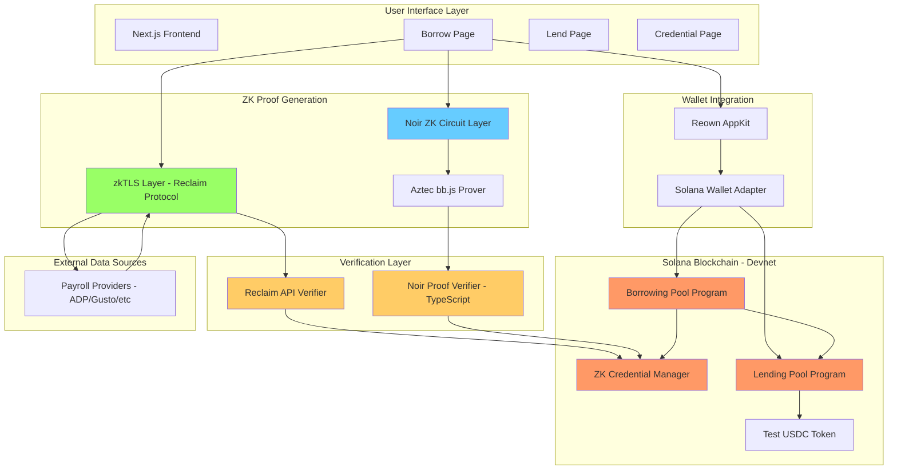
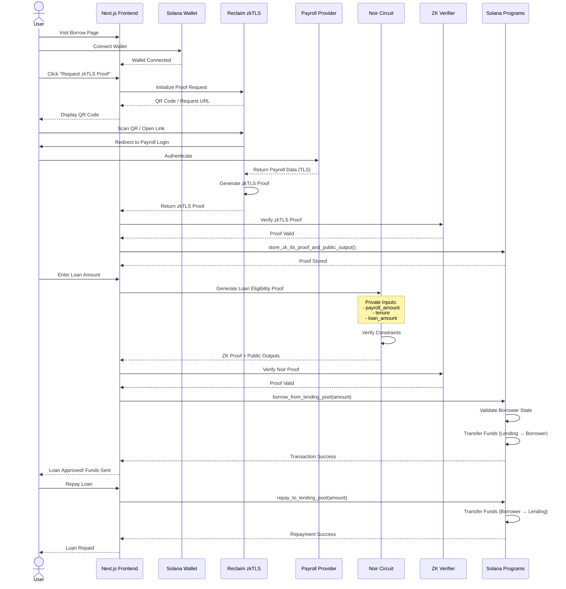

# ZK Payroll-Backed Loan

A decentralized lending platform on Solana that enables privacy-preserving payroll-backed loans using zero-knowledge proofs. Users can borrow funds without collateral by proving their employment and income through zkTLS and Noir ZK circuits, all while maintaining complete privacy.

## Overview

This project demonstrates a novel approach to decentralized lending by combining:
- **zkTLS Protocol (Reclaim Protocol)** - Privacy-preserving payroll verification without sharing credentials
- **Noir ZK Circuits** - On-chain proof verification for loan eligibility
- **Solana Smart Contracts** - Fast, low-cost lending pool management
- **Privacy-First Design** - Zero-knowledge proofs ensure user data remains confidential

The system allows users to obtain loans based on their verified income without requiring traditional collateral, making DeFi lending more accessible while preserving user privacy.

## Technical Stack

### Frontend
- **Next.js 15** - React framework with App Router
- **React 19** - UI library
- **TypeScript** - Type-safe development
- **Reown AppKit** - Solana wallet integration
- **Bootstrap 5** - UI components

### Blockchain
- **Solana** - High-performance blockchain (Devnet)
- **Anchor Framework** - Rust-based Solana program development
- **SPL Token** - Token standard for lending/borrowing

### Zero-Knowledge Proofs
- **Noir** - Privacy-focused programming language for ZK circuits
- **Aztec bb.js** - Proving backend for Noir circuits
- **Reclaim Protocol** - zkTLS proof generation and verification
- **Poseidon Hash** - ZK-friendly cryptographic hash function

### Smart Contracts (Anchor Programs)
1. **ZK Verifiable Credential Manager** (`5noDS5EGojcw8BuRA9vDAmSUBE8iCY2jnQBhzkyEiU1K`)
2. **Lending Pool** (`G1sjiVDaPgDd5yfChYKguKVZs6tD1GE6zewBQwWmsMJi`)
3. **Borrowing Pool** (`CZAYDeyBbkC6DFiV8WRP9bdtdziixV8MP38sS9TARvPi`)
4. **Test USDC** (`41NBEbnBWvQTLs6TRKCDWH88rJTpdFUvq5WA3zpQGYfY`)

## Technical Details

### Smart Contract Architecture

#### 1. ZK Verifiable Credential Manager
Manages zero-knowledge proofs and credentials for borrowers.

**Key Functions:**
- `store_zk_tls_proof_and_public_output()` - Store zkTLS payroll proof (up to 10KB)
- `verify_credential()` - Authority-based credential verification
- `revoke_credential()` - Revoke compromised credentials

**Storage:**
- Proof data: 10KB max
- Public outputs: 2KB max
- PDA-based credential storage

#### 2. Lending Pool
Manages liquidity from lenders and distributes funds to borrowers.

**Key Functions:**
- `initialize_lending_pool()` - Create new lending pool
- `deposit_into_lending_pool()` - Lenders deposit tokens
- `withdraw_from_lending_pool()` - Withdraw principal + interest
- `borrow_from_pool()` - Borrow funds (called via CPI)
- `repay_to_pool()` - Repay borrowed amount

**Features:**
- Configurable interest rates
- Minimum deposit requirements
- Liquidity tracking
- Event emission for all operations

#### 3. Borrowing Pool
Manages borrowing against ZK-verified payroll proofs.

**Key Functions:**
- `borrow_from_lending_pool()` - Borrow based on ZK proof
- `repay_to_lending_pool()` - Repay outstanding loans
- `liquidate()` - Liquidate undercollateralized positions (if applicable)

**Loan Validation:**
- ZK proof verification (eligibility check)
- Payroll-based borrow limits
- Debt tracking per borrower

### Zero-Knowledge Proof Systems

The platform uses two distinct ZK proof systems for comprehensive privacy and security:

## What Each ZK Proof Verifies

### 1. ZK Payroll Proof (using zkTLS Protocol)

**Technology:** Reclaim Protocol - zkTLS SDK

**Purpose:** Verify employment and payroll data from external payroll providers (e.g., ADP, Gusto, Workday) without exposing credentials or raw data.

**What It Proves:**
- User has active employment with a verified employer
- User's monthly payroll/salary amount
- Employment tenure and hire date
- Payroll continuity (consistent payment history)

**How It Works:**
1. User authenticates with their payroll provider through Reclaim's mobile app or browser extension
2. zkTLS protocol creates a zero-knowledge proof of the TLS session
3. Proof is generated showing specific data points (salary, employment status) without revealing:
   - Login credentials
   - Full payroll records
   - Employer details
   - Other sensitive information

**Privacy Guarantees:**
- ✅ No credentials shared with the platform
- ✅ No raw payroll data exposed
- ✅ Employer identity can remain private
- ✅ Only verified claims are revealed (e.g., "salary > $5000")

**Verification Method:**
- Proof verified off-chain via Reclaim Protocol API
- Public outputs stored on-chain in ZK Credential Manager
- Cryptographic signatures ensure authenticity

**Example Public Outputs:**
```json
{
  "monthlyPayroll": 5000,
  "employmentStatus": true,
  "tenureMonths": 24,
  "payrollContinuity": true
}
```

### 2. ZK Payroll-Backed Loan Proof (using Noir ZK Circuit)

**Technology:** Noir ZK Circuit with Poseidon Hashing

**Purpose:** Verify loan eligibility based on payroll data without revealing the underlying payroll information to the smart contract or public.

**Circuit File:** [`circuits/payroll-backed-loan/src/main.nr`](circuits/payroll-backed-loan/src/main.nr)

**What It Proves:**
1. **Employment Status** - User is actively employed
2. **Salary Threshold** - Payroll amount ≥ minimum required amount
3. **Tenure Requirement** - Employment tenure ≥ 12 months
4. **Payroll Continuity** - Consistent payroll history (no missed payments)
5. **Loan Affordability** - Requested loan amount ≤ (payroll × repayment_ratio)
6. **Jurisdiction Compliance** - User's jurisdiction is in allowed list (anti-money laundering)
7. **Nullifier Uniqueness** - Prevents double-spending/duplicate loan applications

**Private Inputs (Never Revealed):**
```noir
{
  payroll_proof: [Field; 64],          // zkTLS proof data
  payroll_amount: u64,                 // e.g., $5000
  employment_status: bool,             // true
  hire_date: u32,                      // e.g., 2022-01-15
  current_date: u32,                   // e.g., 2024-02-02
  min_payroll_amount: u64,             // e.g., $3000
  payroll_history: [Field; 32],        // Hash of past 12+ months
  repayment_ratio: u64,                // e.g., 2 (can borrow 2x monthly salary)
  loan_amount: u64,                    // e.g., $8000
  jurisdiction_code: Field,            // User's jurisdiction
  allowed_jurisdiction_root: Field,    // Merkle root of allowed jurisdictions
  jurisdiction_merkle_proof: [Field; 32]
}
```

**Public Outputs (Revealed On-Chain):**
```noir
{
  nullifier: Field  // Unique identifier to prevent duplicate applications
}
```

**Privacy Guarantees:**
- ✅ Exact payroll amount remains private
- ✅ Employment history details hidden
- ✅ Hire date and tenure details concealed
- ✅ Jurisdiction code kept confidential
- ✅ Only eligibility result ("approved" or "denied") is revealed

**Verification Method:**
- Proof generated client-side using Noir
- Proof verified on-chain (future: Solana verifier program)
- Current: Verification happens in TypeScript before transaction submission

**Circuit Constraints:**
```noir
// Example constraints from the circuit
assert(employment_status == true);
assert(payroll_amount >= min_payroll_amount);
assert(tenure_months >= MIN_TENURE_MONTHS); // 12 months
assert(loan_amount <= payroll_amount * repayment_ratio);
```

**Nullifier Generation:**
```noir
nullifier = poseidon_hash_2(jurisdiction_code, allowed_jurisdiction_root)
```

## Architecture



### Component Interaction Flow

1. **User Authentication** - User connects Solana wallet via Reown AppKit
2. **Payroll Verification** - User generates zkTLS proof through Reclaim Protocol
3. **Proof Storage** - zkTLS proof stored in ZK Credential Manager
4. **Eligibility Check** - Noir circuit generates proof of loan eligibility
5. **Loan Request** - Borrowing program validates and processes loan
6. **Fund Transfer** - Lending pool transfers funds to borrower
7. **Repayment** - Borrower repays loan back to lending pool

## User Flow



### Detailed User Journey

#### For Borrowers:
1. **Connect Wallet** - Connect Solana wallet using Reown AppKit
2. **Verify Payroll** - Generate zkTLS proof using Reclaim Protocol (QR code/browser extension)
3. **Store Credential** - zkTLS proof stored on-chain in ZK Credential Manager
4. **Generate ZK Proof** - Create Noir circuit proof showing loan eligibility
5. **Request Loan** - Submit borrow transaction with ZK proof
6. **Receive Funds** - Get Test USDC tokens in wallet
7. **Repay Loan** - Repay borrowed amount + interest

#### For Lenders:
1. **Connect Wallet** - Connect Solana wallet
2. **Deposit Funds** - Deposit Test USDC into lending pool
3. **Earn Interest** - Receive interest from borrowers
4. **Withdraw** - Withdraw principal + accumulated interest

## Limitations

### Current Implementation Limitations

1. **Devnet Only**
   - Deployed on Solana Devnet only
   - Uses Test USDC tokens (no real value)
   - Not audited for mainnet deployment

2. **ZK Proof Verification**
   - Noir proofs verified off-chain (TypeScript)
   - On-chain Solana verifier program not yet implemented
   - Future: Deploy Groth16/HONK verifier as Solana program

3. **zkTLS Integration**
   - Limited to specific payroll providers supported by Reclaim Protocol
   - Requires Reclaim mobile app or browser extension
   - Depends on third-party zkTLS infrastructure

4. **Scalability**
   - Proof generation is computationally intensive (client-side)
   - Large circuit size may impact browser performance
   - Storage limits (10KB for zkTLS proof, 2KB for public outputs)

5. **Security Considerations**
   - No formal security audit conducted
   - Test environment only - not production-ready
   - Smart contract authority controls need enhancement

6. **Loan Management**
   - Interest rate calculation is simplified
   - No automated liquidation mechanism for defaulted loans
   - Limited credit risk assessment

7. **Privacy Limitations**
   - Public outputs reveal loan approval status
   - Nullifiers can be correlated across applications
   - On-chain transaction history is public

8. **User Experience**
   - Proof generation can take 10-60 seconds
   - Requires multiple transaction confirmations
   - Mobile-first zkTLS flow may not be convenient for desktop users

## Next on the Roadmap

### Phase 1: On-Chain Verification (Q1 2025)
- [ ] Implement Groth16 verifier contract for Solana
- [ ] Deploy HONK/UltraPLONK verifier using Anchor
- [ ] Integrate Solana verifier with borrowing program
- [ ] Benchmark on-chain verification costs

### Phase 2: Enhanced Privacy (Q2 2025)
- [ ] Implement anonymous credentials using BBS+ signatures
- [ ] Add decoy transactions for better privacy
- [ ] Implement private loan pools (lender privacy)
- [ ] Zero-knowledge credit scoring system

### Phase 3: Risk Management (Q2-Q3 2025)
- [ ] Dynamic interest rates based on ZK credit scores
- [ ] Automated liquidation with grace periods
- [ ] Insurance pool for lender protection
- [ ] Multi-factor ZK identity verification

### Phase 4: Advanced Features (Q3 2025)
- [ ] Cross-chain lending (Solana ↔ Ethereum via Wormhole)
- [ ] Loan refinancing and consolidation
- [ ] Partial repayment schedules
- [ ] Decentralized dispute resolution

### Phase 5: Ecosystem Expansion (Q4 2025)
- [ ] Support for multiple payroll providers (50+ providers)
- [ ] Integration with Web2 income sources (freelancer platforms, gig economy)
- [ ] zkPassport integration for jurisdiction verification
- [ ] OFAC sanctions screening using ZK circuits

### Phase 6: Production Deployment (Q1 2026)
- [ ] Comprehensive security audit (smart contracts + ZK circuits)
- [ ] Mainnet deployment on Solana
- [ ] Regulatory compliance framework
- [ ] Bug bounty program
- [ ] User onboarding flow optimization

### Long-Term Vision
- **Decentralized Credit Bureau** - Privacy-preserving credit history
- **AI-Powered Risk Assessment** - ZK machine learning for loan approval
- **Global Accessibility** - Support for 100+ countries
- **Traditional Finance Integration** - Bridge to TradFi lending markets

## References

### Zero-Knowledge Proofs
- [Noir Language Documentation](https://noir-lang.org/)
- [Aztec bb.js Documentation](https://docs.aztec.network/)
- [Poseidon Hash Function](https://www.poseidon-hash.info/)
- [zkSNARKs Explained](https://z.cash/technology/zksnarks/)

### zkTLS & Reclaim Protocol
- [Reclaim Protocol Documentation](https://docs.reclaimprotocol.org/)
- [Reclaim Developer Console](https://dev.reclaimprotocol.org/)
- [zkTLS Overview](https://docs.reclaimprotocol.org/zktls)
- [Reclaim JS SDK](https://www.npmjs.com/package/@reclaimprotocol/js-sdk)

### Solana Development
- [Solana Documentation](https://docs.solana.com/)
- [Anchor Framework](https://www.anchor-lang.com/)
- [Solana Program Library (SPL)](https://spl.solana.com/)
- [Reown AppKit for Solana](https://docs.reown.com/appkit/overview)

### Related Projects
- [zkPassport - SunSpot Example](https://github.com/zkPassport/sunspot-example)
- [Aztec Protocol](https://aztec.network/)
- [Tornado Cash](https://tornado.cash/) (Privacy on Ethereum)
- [Mina Protocol](https://minaprotocol.com/) (ZK-based blockchain)

### Research Papers
- [zkTLS: Transport Layer Security with Zero-Knowledge Proofs](https://eprint.iacr.org/2023/1456)
- [Privacy-Preserving Credit Scoring](https://eprint.iacr.org/2022/834)
- [Zero-Knowledge Proofs for Financial Services](https://arxiv.org/abs/2110.14067)

### Community & Support
- [Noir Discord](https://discord.gg/noir)
- [Solana Stack Exchange](https://solana.stackexchange.com/)
- [Reclaim Protocol Telegram](https://t.me/reclaimprotocol)

---

**Built for Solana Privacy Hackathon 🔐 (Jan 12 - Feb 1, 2026)**

**License:** MIT

**Contributors:** Welcome! Please open an issue or PR.