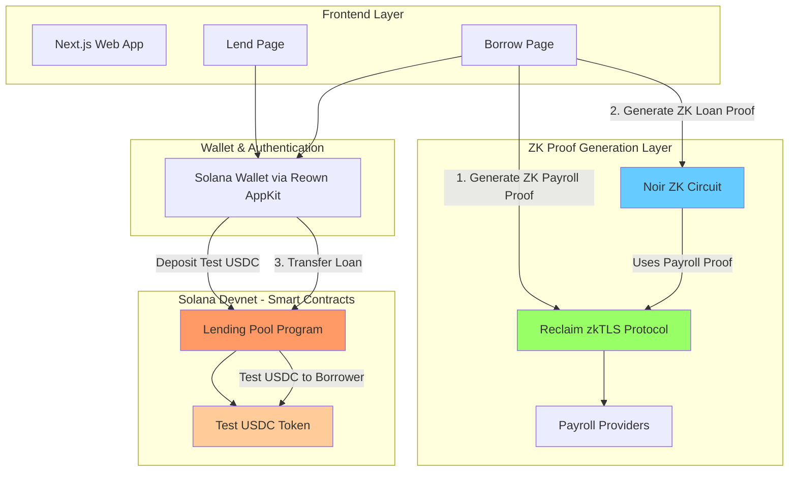
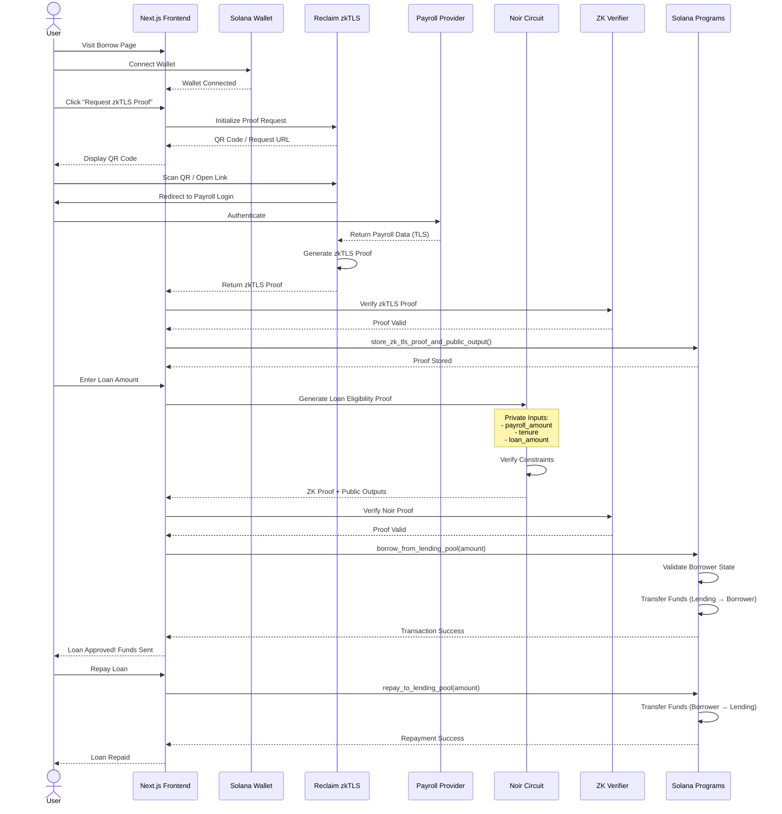

# ZK Payroll-Backed Loan

This project is the ZK Payroll-Backed Loan platform on Solana (Devnet) that enables a privacy-preserving payroll-backed loans using zero-knowledge proofs without any collateral and disclosing sensitive informations for borrowers by: 
- proving a borrower's **payroll/income** through `zkTLS` protocol.
- proving a borrower's **loan eligibility** through `Noir` ZK circuits.

## Overview

This project demonstrates a novel approach to decentralized lending by combining:
- **zkTLS Protocol (Reclaim Protocol)** - Generate a `ZK Payroll Proof`, which enable a borrower to prove their actual payroll histories (i.e. Payroll/Income amount, Payroll period, etc) without sharing credentials
- **`Noir` ZK Circuits** - Generate a `ZK Payroll-Backed Loan Proof`, which enable a borrower to prove a loan eligibility based on the `ZK Payroll Proof` above without disclosing their sensitive informations.
- **Solana Smart Contracts** - Fast, low-cost lending pool management and loan funds management. 
- **Privacy-First Design** - Zero-knowledge proofs ensure user data remains confidential

The system allows users to obtain loans based on their `verified payroll/income` and `verified loan eligibility` without requiring any collateral and a long loan eligibility valification process while preserving user privacy.

## Technical Stack

### Zero-Knowledge Proofs
- **`Noir`** - Privacy-focused programming language for ZK circuits
- **Aztec `bb.js`** - Proving backend for Noir circuits. In this project, this is used for the `off-chain` verificaton on client-side as well.

- **Reclaim Protocol** - zkTLS proof generation and verification
- **Poseidon Hash** - ZK-friendly cryptographic hash function

### Blockchain
- **Solana** - High-performance blockchain (Devnet)
- **Anchor Framework** - Rust-based Solana program development
- **SPL Token** - In this project, this is used for the `Test USDC` token.

### Smart Contracts (Anchor Programs)
- See the README in the [./contract directory]().

### Frontend
- See the README in the [./app directory]().


## What Each ZK Proof Verifies

### 1. ZK Payroll Proof (using zkTLS Protocol)

**Technology:** `Reclaim Protocol`'s `zkTLS SDK`

**Purpose:** Verify the borrower's `payroll data` from **external `payroll providers` (e.g., ADP, Gusto, Workday)** without exposing credentials or raw data.

**What It Proves:**
- User has active employment with a verified employer
- User's monthly payroll/salary amount
- Employment tenure and hire date
- Payroll continuity (consistent payment history)

**How It Works:**
1. User authenticates with their payroll provider through Reclaim's mobile app or browser extension
2. zkTLS protocol creates a zero-knowledge proof of the TLS session
3. Proof is generated showing specific data points (salary, employment status) without revealing:
   - Login credentials
   - Full payroll records
   - Employer details
   - Other sensitive information

**Privacy Guarantees:**
- ✅ No credentials shared with the platform
- ✅ No raw payroll data exposed
- ✅ Employer identity can remain private
- ✅ Only verified claims are revealed (e.g., "salary > $5000")

**Verification Method:**
- Proof verified off-chain via Reclaim Protocol API
- Public outputs stored on-chain in ZK Credential Manager
- Cryptographic signatures ensure authenticity

**Example Public Outputs:**
```json
{
  "monthlyPayroll": 5000,
  "employmentStatus": true,
  "tenureMonths": 24,
  "payrollContinuity": true
}
```

### 2. ZK Payroll-Backed Loan Proof (using Noir ZK Circuit)

**Technology:** Noir ZK Circuit with Poseidon Hashing

**Purpose:** Verify the borrower's `loan eligibility` based on the verified `payroll data` without revealing the `underlying payroll informations`.

**Circuit File:** [`circuits/payroll-backed-loan/src/main.nr`](circuits/payroll-backed-loan/src/main.nr)

**What It Proves:**
1. **Employment Status** - User is actively employed
2. **Salary Threshold** - Payroll amount ≥ minimum required amount
3. **Tenure Requirement** - Employment tenure ≥ 12 months
4. **Payroll Continuity** - Consistent payroll history (no missed payments)
5. **Loan Affordability** - Requested loan amount ≤ (payroll × repayment_ratio)
6. **Jurisdiction Compliance** - User's jurisdiction is in allowed list (anti-money laundering)
7. **Nullifier Uniqueness** - Prevents double-spending/duplicate loan applications

**Private Inputs (Never Revealed):**
```noir
{
  payroll_proof: [Field; 64],          // zkTLS proof data
  payroll_amount: u64,                 // e.g., $5000
  employment_status: bool,             // true
  hire_date: u32,                      // e.g., 2022-01-15
  current_date: u32,                   // e.g., 2024-02-02
  min_payroll_amount: u64,             // e.g., $3000
  payroll_history: [Field; 32],        // Hash of past 12+ months
  repayment_ratio: u64,                // e.g., 2 (can borrow 2x monthly salary)
  loan_amount: u64,                    // e.g., $8000
  jurisdiction_code: Field,            // User's jurisdiction
  allowed_jurisdiction_root: Field,    // Merkle root of allowed jurisdictions
  jurisdiction_merkle_proof: [Field; 32]
}
```

**Public Outputs (Revealed On-Chain):**
```noir
{
  nullifier: Field  // Unique identifier to prevent duplicate applications
}
```

**Privacy Guarantees:**
- ✅ Exact payroll amount remains private
- ✅ Employment history details hidden
- ✅ Hire date and tenure details concealed
- ✅ Jurisdiction code kept confidential
- ✅ Only eligibility result ("approved" or "denied") is revealed

**Verification Method:**
- Proof generated client-side using Noir
- Proof verified on-chain (future: Solana verifier program)
- Current: Verification happens in TypeScript before transaction submission

**Circuit Constraints:**
```noir
// Example constraints from the circuit
assert(employment_status == true);
assert(payroll_amount >= min_payroll_amount);
assert(tenure_months >= MIN_TENURE_MONTHS); // 12 months
assert(loan_amount <= payroll_amount * repayment_ratio);
```

**Nullifier Generation:**
```noir
nullifier = poseidon_hash_2(jurisdiction_code, allowed_jurisdiction_root)
```

## Architecture



### Simple Flow Overview

#### Lending Flow
1. **Lender** connects Solana wallet via Reown AppKit
2. **Lender** clicks "Deposit" button with desired Test USDC amount
3. **Test USDC tokens** are transferred into the Lending Pool contract

#### Borrowing Flow
1. **Borrower** connects Solana wallet via Reown AppKit
2. **Borrower** clicks "Request a Loan" button with desired loan amount
3. **Step 1:** Generate ZK Payroll Proof via Reclaim zkTLS protocol
   - Borrower proves payroll/income from external providers (ADP, Gusto, etc.)
4. **Step 2:** Generate ZK Payroll-backed Loan Proof via Noir ZK circuit
   - Circuit verifies loan eligibility based on payroll proof
5. **Step 3:** Transfer loan amount in Test USDC from Lending Pool to Borrower on Solana Devnet
   - Smart contract validates proofs and executes transfer

## User Flow



### Detailed User Journey

#### For Lenders:
1. **Connect Wallet** - Connect Solana wallet
2. **Deposit Funds** - Deposit Test USDC into lending pool
3. **Earn Interest** - Receive interest from borrowers
4. **Withdraw** - Withdraw principal + accumulated interest

#### For Borrowers:
1. **Connect Wallet** - Connect Solana wallet using Reown AppKit
2. **Verify Payroll** - Generate zkTLS Payroll Proof using Reclaim Protocol (QR code/browser extension)
3. **Store Credential** - zkTLS proof stored on-chain in ZK Credential Manager
4. **Request Loan** - Submit a loan request with a loan amount. Then, a ZK Payroll-Backed Proof generation will get started, which check a borrower's loan eligibility based on a verified payroll data (zkTLS Payroll Proof and its public inputs by Reclaim zkTLS protocol)
5. **Receive Funds** - Get Test USDC tokens in wallet
6. **Repay Loan** - Repay borrowed amount + interest


## DEMO Video

- https://www.loom.com/share/6872125a457c4ec7ba5fdb9180e3af48

## Limitations

### Current Implementation Limitations

1. **Devnet Only**
   - Deployed on Solana Devnet only
   - Uses Test USDC tokens (no real value)
   - Not audited for mainnet deployment

2. **For `ZK Payroll-Backed Loan Proof` verification**
   - Noir proofs verified `off-chain` (using `@aztec/bb.js`) at the momemnt.
   - On-chain Solana verifier program using `SunSpot` has not implemented yet.

3. **For `ZK Payroll Proof` generation & verification: zkTLS Integration (using Reclaim zkTLS protocol and its zkTLS SDK)**
   - In progress to integrate

6. **Loan Management**
   - Interest rate calculation is simplified
   - No automated liquidation mechanism for defaulted loans
   - Limited credit risk assessment


## Roadmap

- Complete the zkTLS protocol (Reclaim Protocol) integration.

- Complete the `Sanction (OFAC) Check` circuit using `Noir`.

- Integrate `SunSpot` in order to realize the on-chain verification of ZK Payroll-Backed Loan Proof using Noir ZK circuit on Solana Devnet


## References

### `Noir` ZK circuit
- [Noir Language Documentation](https://noir-lang.org/)
- [Aztec Documentation](https://docs.aztec.network/)

### zkTLS & Reclaim Protocol
- [Reclaim Protocol Documentation](https://docs.reclaimprotocol.org/)
- [Reclaim Developer Console](https://dev.reclaimprotocol.org/)
- [zkTLS Overview](https://docs.reclaimprotocol.org/zktls)
- [Reclaim JS SDK](https://www.npmjs.com/package/@reclaimprotocol/js-sdk)

### Solana Development
- [Solana Documentation](https://docs.solana.com/)
- [Anchor Framework](https://www.anchor-lang.com/)
- [Solana Program Library (SPL)](https://spl.solana.com/)
- [Reown AppKit for Solana](https://docs.reown.com/appkit/overview)

