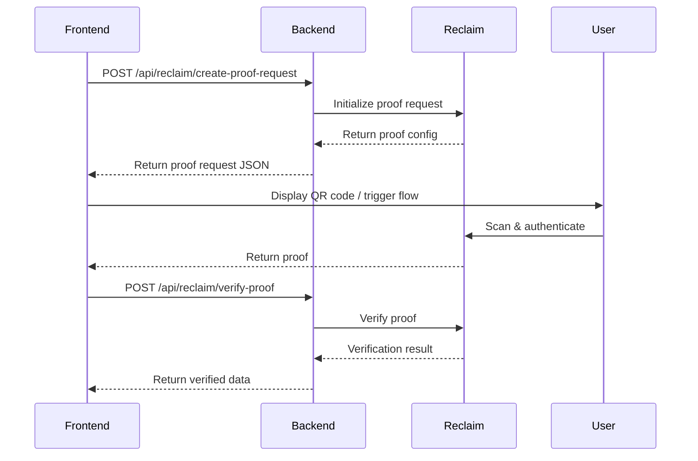

# zkTLS Integration Guide

This Next.js app integrates **Reclaim Protocol's zkTLS SDK** for secure payroll verification in the Payroll-Backed Loan application.

## 🚀 Quick Start

### 1. Install Dependencies

Dependencies are already installed, but if needed:

```bash
npm install @reclaimprotocol/js-sdk
```

### 2. Configure Environment Variables

Create a `.env.local` file in the app directory:

```bash
cp .env.local.example .env.local
```

Then edit `.env.local` and add your Reclaim Protocol credentials:

```env
RECLAIM_APP_ID=your_app_id_here
RECLAIM_APP_SECRET=your_app_secret_here
RECLAIM_PROVIDER_ID=payroll-provider
```

**Get your credentials:**
- Visit [Reclaim DevTool](https://dev.reclaimprotocol.org/)
- Follow the [API Key Guide](https://docs.reclaimprotocol.org/api-key)

### 3. Run the Development Server

```bash
npm run dev
```

Visit [http://localhost:3000](http://localhost:3000)

## 📁 Project Structure

```
app/
├── src/
│   ├── app/
│   │   ├── api/
│   │   │   └── reclaim/
│   │   │       ├── create-proof-request/
│   │   │       │   └── route.ts          # Backend: Create proof request
│   │   │       └── verify-proof/
│   │   │           └── route.ts          # Backend: Verify proof
│   │   ├── page.tsx                      # Main page
│   │   └── layout.tsx
│   ├── components/
│   │   ├── ActionButtonList.tsx          # Updated with zkTLS button
│   │   ├── ZkTlsButton.tsx              # zkTLS proof generation button
│   │   ├── ConnectButton.tsx
│   │   └── InfoList.tsx
│   ├── hooks/
│   │   ├── useZkTlsProof.ts             # Custom hook for proof generation
│   │   └── useClientMount.ts
│   ├── lib/
│   │   └── zktls/
│   │       └── zktls-operation.ts        # Reclaim SDK integration
│   └── config/
│       └── index.ts
└── .env.local.example
```

## 🔐 How It Works

### 1. **User Flow**

1. User connects their Solana wallet
2. User clicks "Request zkTLS Proof Generation" button
3. QR code appears (or browser extension is used)
4. User scans QR code on mobile device
5. User authenticates with their payroll provider
6. Proof is generated using zkTLS
7. Proof is verified on the backend
8. Verified payroll data is displayed

### 2. **Technical Flow**



### 3. **Components**

#### **ZkTlsButton Component**
- Main UI component for proof generation
- Integrates with Solana wallet
- Shows loading states and error messages
- Displays verified proof data

#### **useZkTlsProof Hook**
- Manages proof generation state
- Handles API calls to backend
- Processes Reclaim SDK callbacks
- Returns proof data and error states

#### **API Routes**

**`/api/reclaim/create-proof-request`**
- Creates proof request with Reclaim SDK
- Uses server-side credentials (secure)
- Returns proof request JSON for frontend

**`/api/reclaim/verify-proof`**
- Verifies proof cryptographically
- Extracts verified payroll data
- Critical security endpoint

## 🔧 Usage Example

### In a Component

```tsx
import { ZkTlsButton } from '@/components/ZkTlsButton';

export default function MyPage() {
  return (
    <div>
      <h1>Payroll Verification</h1>
      <ZkTlsButton />
    </div>
  );
}
```

### Using the Hook Directly

```tsx
'use client';

import { useZkTlsProof } from '@/hooks/useZkTlsProof';
import { useAppKitAccount } from '@reown/appkit/react';

export function CustomProofButton() {
  const { address } = useAppKitAccount();
  const { isGenerating, error, proofData, requestProof } = useZkTlsProof();

  const handleVerify = async () => {
    await requestProof(address);
  };

  return (
    <div>
      <button onClick={handleVerify} disabled={isGenerating}>
        {isGenerating ? 'Generating...' : 'Verify Payroll'}
      </button>
      
      {error && <p>Error: {error}</p>}
      
      {proofData && (
        <div>
          <h3>Verified Data:</h3>
          <pre>{JSON.stringify(proofData, null, 2)}</pre>
        </div>
      )}
    </div>
  );
}
```

## 🌟 Features

- ✅ **Secure Backend Verification**: Proofs are verified server-side
- ✅ **Solana Wallet Integration**: Uses connected wallet address
- ✅ **Beautiful UI**: Dark theme with loading states
- ✅ **Error Handling**: Comprehensive error messages
- ✅ **Type-Safe**: Full TypeScript support
- ✅ **Multiple Verification Methods**: QR code, browser extension, or mobile app
- ✅ **Real-time Feedback**: Shows progress during verification

## 📚 Additional Resources

- [Reclaim Protocol Docs](https://docs.reclaimprotocol.org/)
- [JavaScript SDK Guide](https://docs.reclaimprotocol.org/js-sdk/installation)
- [Available Providers](https://dev.reclaimprotocol.org/explore)
- [Get API Credentials](https://dev.reclaimprotocol.org/)

## 🔒 Security Notes

- **Never** expose `RECLAIM_APP_SECRET` in frontend code
- **Always** verify proofs on the backend
- Store sensitive credentials in `.env.local` (not committed to git)
- The `.env.local` file is already in `.gitignore`

## 🐛 Troubleshooting

### "Reclaim credentials not configured"
- Make sure `.env.local` exists with valid credentials
- Restart the dev server after adding env variables

### "Failed to create proof request"
- Check that your APP_ID and APP_SECRET are correct
- Verify you have an active internet connection
- Check the Reclaim DevTool for service status

### "Proof verification failed"
- Make sure the proof was generated successfully
- Check backend logs for detailed error messages
- Verify the provider ID is correct

## 📝 License

Same as parent project.
